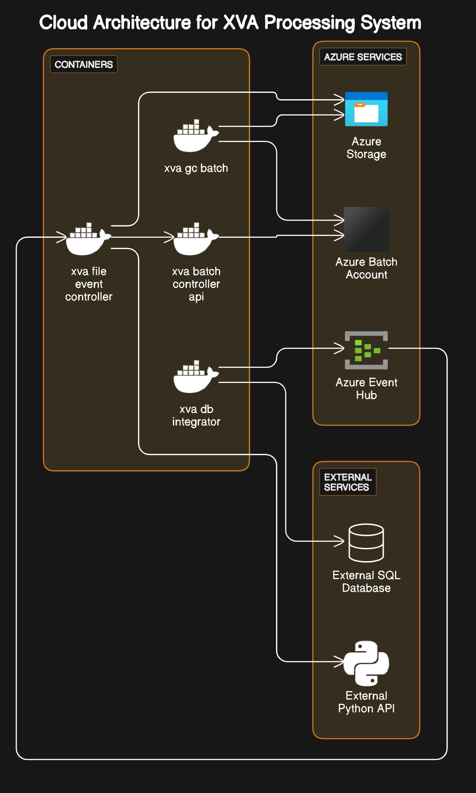

# XVA Laboratório

Este repo tem o objetivo de documentar as provas de conceito, e estudo envolvendo XP/Microsoft, com o objetivo de criar uma pipeline para agendamento e processamento de XVA, usando [Azure Batch Account](https://learn.microsoft.com/azure/batch/).

## Arquitetura

A arquitetura deste repo é modular e todos os componentes podem ser rodados via `cli`, por exemplo.

- `xva-db-integrator`: Este componente é um contêiner responsável por realizar operações de long polling em um banco de dados SQL local. Ele opera com base em um cronograma cron, executando tarefas em horários específicos. Quando determinadas condições são atendidas ou eventos ocorrem no banco de dados, ele dispara um evento que é enviado para um Azure Event Hub.

- `xva-file-event-controller`: Ao receber eventos do Event Hub, este contêiner os processa. Ele chama uma API externa, que é uma API Python publicada localmente. A API externa gera um arquivo de entrada com base nos dados do evento recebido. Após gerar o arquivo,  `xva-file-event-controller` o envia para o Azure Storage para armazenamento e uso posterior. Além disso, este componente se comunica com xva-batch-controller-api por meio de chamadas HTTP.

- `xva-batch-controller-api`: Este contêiner hospeda uma API da web que se integra a uma Conta do Azure Batch. Ele recebe solicitações e comandos de outros componentes, como xva-file-event-controller. A API interage com os serviços do Azure Batch para gerenciar e executar tarefas de processamento em lote.

- `xva-batch-gc`: Este componente é responsável por limpar arquivos no Azure Storage e gerenciar tarefas na Conta do Azure Batch. Ele verifica periodicamente arquivos expirados ou não utilizados no Azure Storage e os exclui. Também monitora e gerencia tarefas concluídas ou abandonadas na Conta do Azure Batch, garantindo uma utilização eficiente dos recursos.



```dotnetcli
+------------------------------------------+
|              SQL On-Premises             |
|                 Banco de Dados           |
+------------------------------------------+
                    |
                    |
                    v
+------------------------------------------+
|             xva-db-integrator             |
|        (Contêiner de Long Polling)        |
+------------------------------------------+
                    |
                    |
                    v
+------------------------------------------+
|              Azure Event Hub              |
|         (Armazenamento e Eventos)         |
+------------------------------------------+
                    |
                    |
                    v
+------------------------------------------+
|        xva-file-event-controller          |
|     (Processamento de Eventos e API)      |
+------------------------------------------+
                    |
                    |
                    v
+------------------------------------------+
|              Azure Storage                |
|        (Serviço de Armazenamento)         |
+------------------------------------------+
                    |
                    |
                    v
+------------------------------------------+
|        xva-batch-controller-api           |
|           (Contêiner da API Web)          |
+------------------------------------------+
                    |
                    |
                    v
+------------------------------------------+
|            Conta do Azure Batch           |
|      (Processamento e Execução em Lote)   |
+------------------------------------------+
                    |
                    |
                    v
+------------------------------------------+
|                xva-batch-gc               |
|   (Limpeza de Arquivos e Gerenciamento)   |
+------------------------------------------+

```

## Pré-requisitos

- [Azure Kubernetes Service](https://learn.microsoft.com/azure/aks/intro-kubernetes)
- [Azure Storage](https://learn.microsoft.com/azure/storage/common/storage-introduction)
- [Azure Batch Account](https://learn.microsoft.com/azure/batch/accounts)
- [Azure Event Hubs](https://learn.microsoft.com/azure/event-hubs/event-hubs-features)

## Como criar uma imagem personalizada para usar no Pool do Batch Account
Esta seção aponta o metódo para criação de uma imagem baseada em Red Hat para ser usada em um pool de Azure Batch. 

  - Requisitos para máquina virtual modelo; 
      - Utilizar imagens Gen1.
      - Configurar seguraça Standard.
      - Em caso de criação de uma máquina virtual nova para esta finalidade, utilizar usuário em vez de par de chaves SSH.
  
  
  - Seguir com o fluxo normal de criação e aguardar a implantação da máquina virtual finalizar.
  - Acessar máquina virtual criada no passo anterior e navegar até o menu de discos.
  - Selecionar o disco de Sistema Operacional e depois na opção de criar uma imagem.
  - No menu de criação de imagem , seguir o fluxo criando uma nova galeria e uma nova definição de imagem (caso já tenha galeria e definições que atendam, as mesmas podem ser reutilizadas).
  - Após criação da imagem, a mesma pode ser utilizada no Pool de Azure Batch.
  - Após selecionar a imagem criada anteriormente, selecione segurança standard e neste mesmo passo, selecionar o OS Agent EL8.
  - Aguarde a implantação do Pool com a imagem personalizada.

## Configuração e Deployment dos componentes

A próxima seção é dedicada sobre como configurar, utilizar e publicar um dos componentes.

### xva-batch-controller-cli

Componente responsável por utilizar a interface de comunicação com o `Azure Batch`, componente desenhado para realização de teste locais.

Parâmetros:

- `--input`: O nome do arquivo de entrada que será processado pelo programa, este precisa estar presente no `Storage`.
- `--output`: O nome do arquivo de saída gerado pelo programa e direcionado para o `Storage`.
- `--app`: O ID da aplicação que está sendo executada. Este precisa estar no `appSettings` na seção de aplicação.
- `--delete-previus`: Um sinalizador booleano opcional que indica se o programa deve excluir o trabalho anterior associado à aplicação.

Exemplo:

```dotnetcli
dotnet run --input "nome-do-arquivo-de-entrada.txt" --output "nome-do-arquivo-de-saida.txt" --app "id-da-aplicacao" --delete-previus
```

Configurações chave:

```json
"Applications": [
    {
      "ApplicationId": "xva_moc",
      "Version": "2",
      "Command": "/bin/sh -c  '$AZ_BATCH_APP_PACKAGE_xva_moc_2/linux-x64/mvp-xp-batching <<INPUTFILE>> <<OUTPUTFILE>>'"
    }
  ]
```

Todos os objetos do segmento `Application` são referências aos [Application Packages](https://learn.microsoft.com/azure/batch/batch-application-packages), não substitua as palavras `<<INPUTFILE>>`,`<<OUTPUTFILE>>`. Elas serão usadas pela aplicação para substituir os parâmetros `--input/--output` passados pela `cli`.

### xva-batch-controller-api

Componente responsável por utilizar a interface de comunicação com o `Azure Batch`.

Docker Build/Run:
```sh
cd xva-batch-controller-api
docker build -t xva-batch-controller-api -f .\Dockerfile ..\
docker run xva-batch-controller-api
```

Configurações chave:
```json
"Applications": [
    {
      "ApplicationId": "xva_moc",
      "Version": "2",
      "Command": "/bin/sh -c  '$AZ_BATCH_APP_PACKAGE_xva_moc_2/linux-x64/mvp-xp-batching <<INPUTFILE>> <<OUTPUTFILE>>'"
    }
  ]
```

Todos os objetos do segmento `Application` são referências aos [Application Packages](https://learn.microsoft.com/azure/batch/batch-application-packages), não substitua as palavras `<<INPUTFILE>>`,`<<OUTPUTFILE>>`. Elas serão usadas pela aplicação para substituir os parâmetros recebidos pela requisição `http`.

Deploy on Kubernetes:
```sh
kubectl apply -f .\artefatos\xva-batch-controller-api\deploy.yaml
kubectl apply -f .\artefatos\xva-batch-controller-api\service.yaml
```

### xva-file-controller

Ele chama uma API externa, que é uma API Python publicada localmente. A API externa gera um arquivo de entrada com base nos dados do evento recebido. Após gerar o arquivo,ele o envia para o Azure Storage para armazenamento e uso posterior. Além disso, este componente se comunica com xva-batch-controller-api por meio de chamadas HTTP. Foi desenhado para ser uma `cli`, possibilitando teste locais.

Parâmetros:

- `--bookname`: O nome do `book_xva` que o programa gerará o arquivo.
- `--booktype`: O tipo do`book_xva` (exemplo: `cpp`,`py`).
- `--filetype`: A extensão do arquivo que será gerado pelo programa.

Exemplo:

```dotnetcli
dotnet run --bookname "reatil" --booktype "cpp" --filetype ".json"
```

### xva-file-event-controller

Ao receber eventos do Event Hub, este contêiner os processa. Ele chama uma API externa, que é uma API Python publicada localmente. A API externa gera um arquivo de entrada com base nos dados do evento recebido. Após gerar o arquivo,ele o envia para o Azure Storage para armazenamento e uso posterior. Além disso, este componente se comunica com xva-batch-controller-api por meio de chamadas HTTP.

Docker Build/Run:
```sh
cd xva-file-event-controller
docker build -t xva-file-event-controller -f .\Dockerfile ..\
docker run xva-file-event-controller
```

Deploy on Kubernetes:
```sh
kubectl apply -f .\artefatos\xva-file-event-controller\deploy.yaml
```

### xva-db-integrator

Este componente é um contêiner responsável por realizar operações de long polling em um banco de dados SQL local. Ele opera com base em um cronograma cron, executando tarefas em horários específicos. Quando determinadas condições são atendidas ou eventos ocorrem no banco de dados, ele dispara um evento que é enviado para um Azure Event Hub.

Este componente foi desenhado para rodar como um [CronJob](https://kubernetes.io/docs/concepts/workloads/controllers/cron-jobs/) no [Kubernetes](https://kubernetes.io), o que implica que as configurações principais estarão no arquivo `artefatos\xva-db-integrator\cronjob.yaml`, como por exemplo:

```yaml
spec:
  schedule: "*/1 * * * *" //Irá rodar uma vez a cada minuto     
```

Docker Build/Run:
```sh
cd xva-db-integrator
docker build -t xva-db-integrator -f .\Dockerfile ..\
docker run xva-db-integrator
```

Deploy on Kubernetes:
```sh
kubectl apply -f .\artefatos\xva-db-integrator\cronjob.yaml
```
